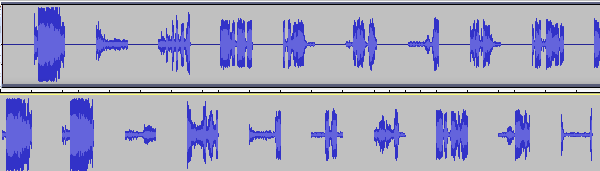
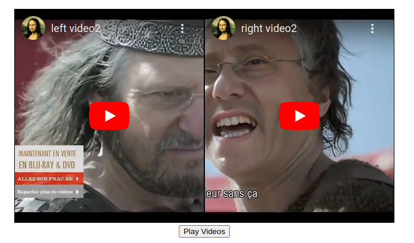
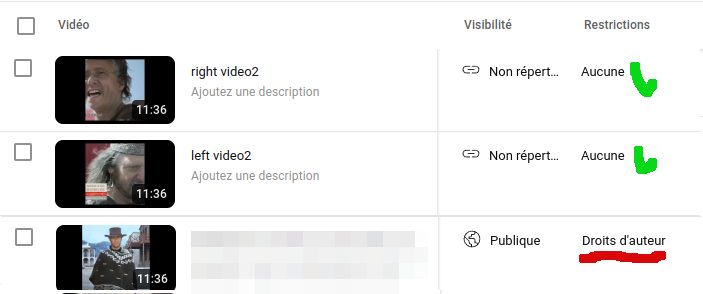

# hackuncensoreUtube
A little hack to by pass the censure of Utube.

# How does it work

Please install a good environement for python ( virtualenv ... ) 

python videosplit2.py [yourvideo]

.This split the video in two part, and mute on each video one second , with an offset of one second for the second one. 

. After in other html page , display the two video together , like behind

To play video click on the button play video. 

Then the sound will be synchronise ( you should have a good connection ).

The Voice to text of utube will to lost.

# Result 

# Dependencies

* argparse
* moviepy
